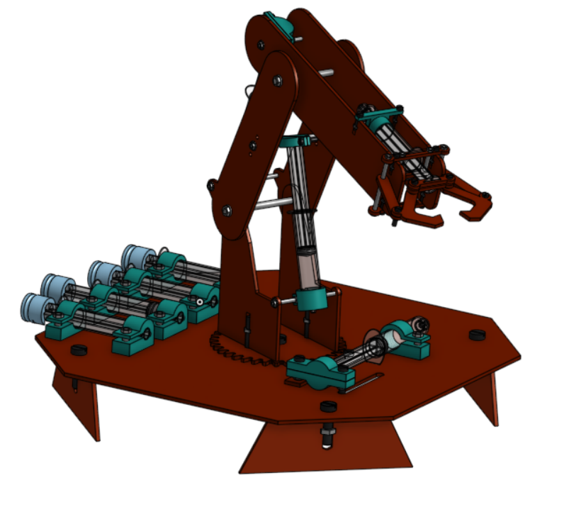
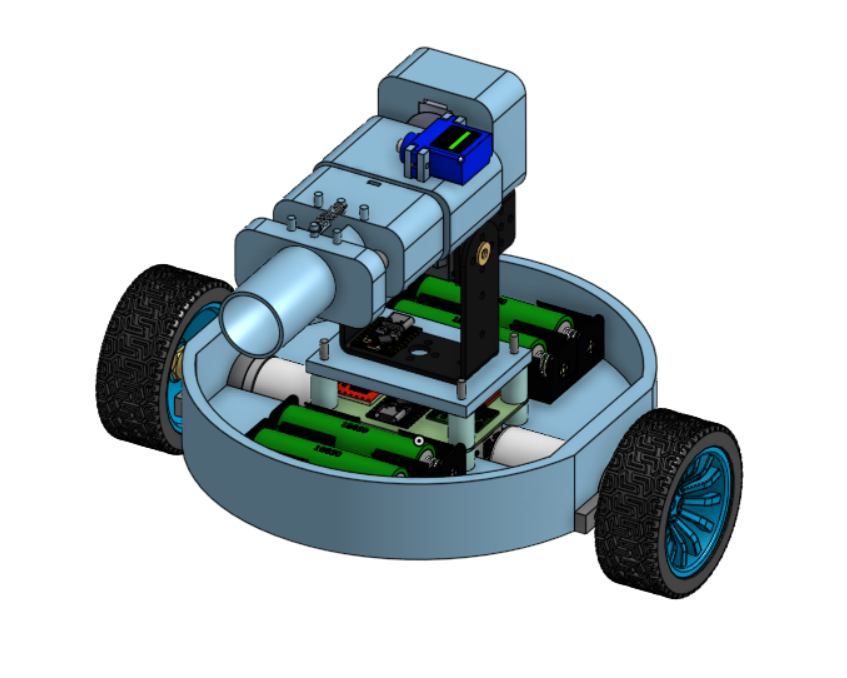
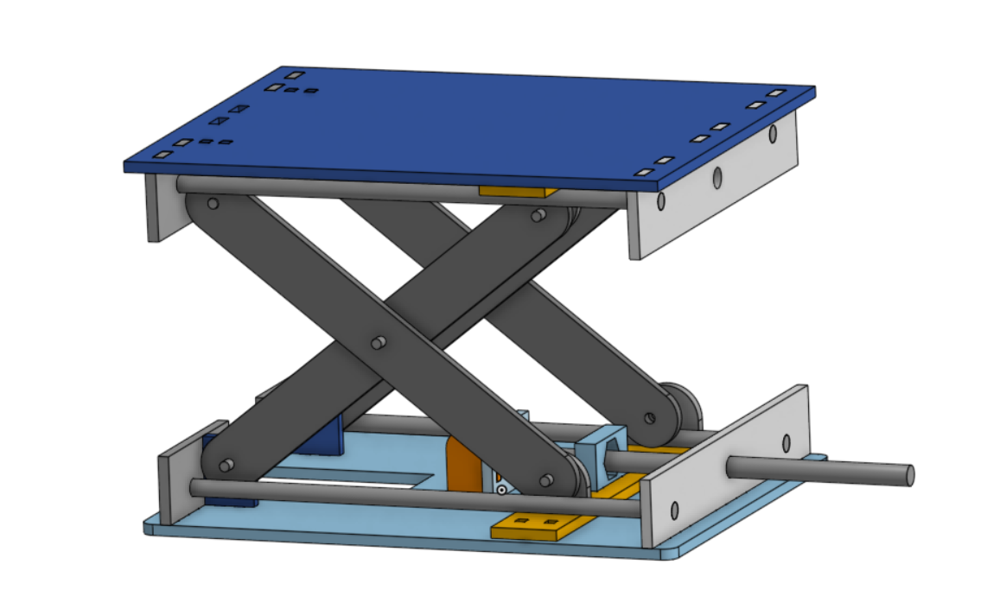
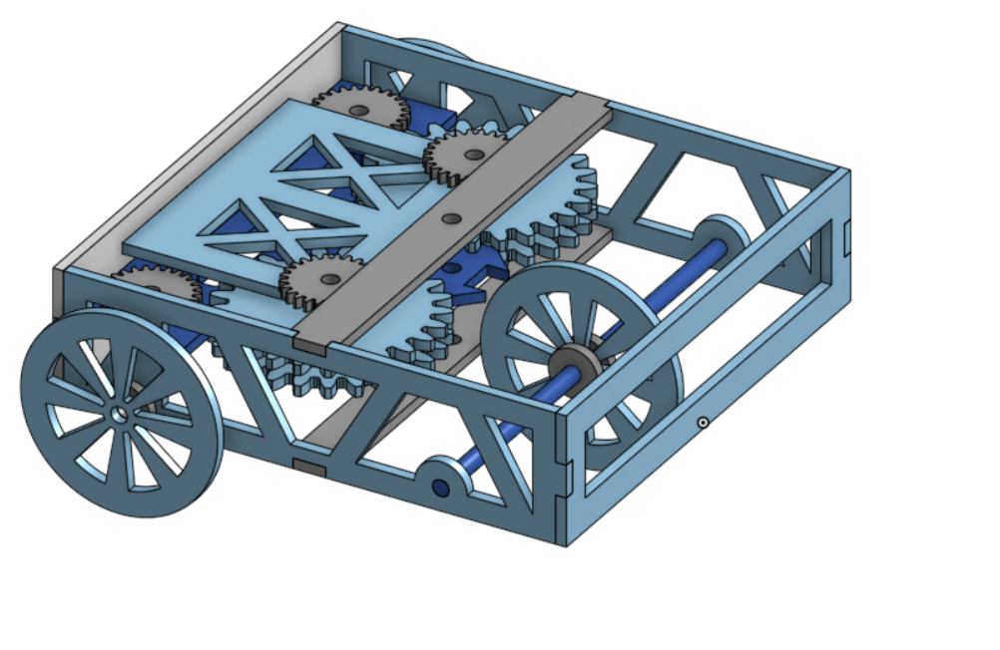
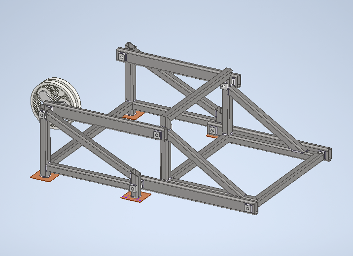
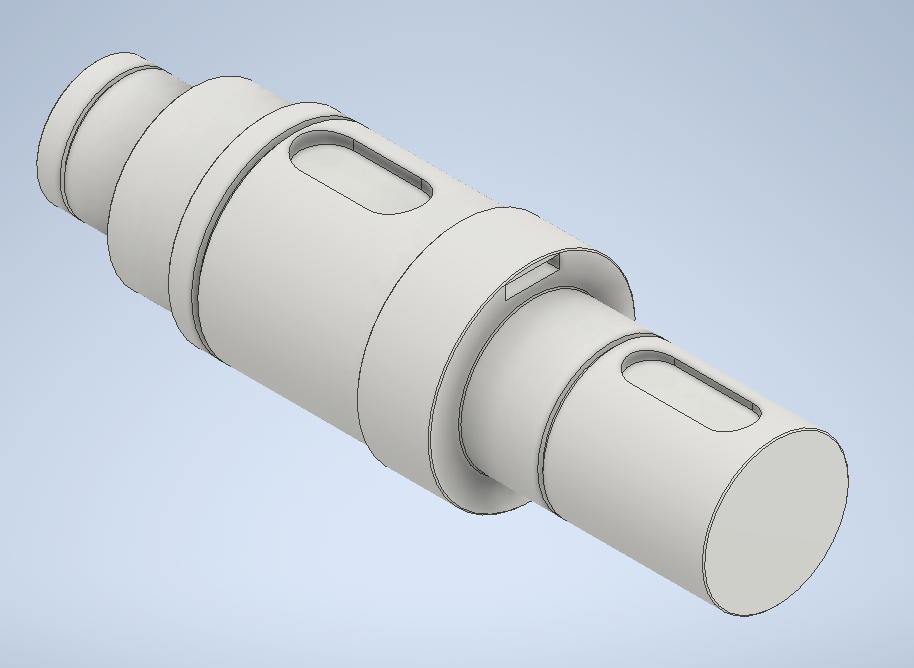
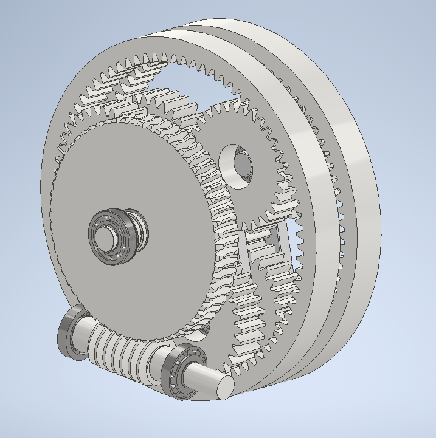
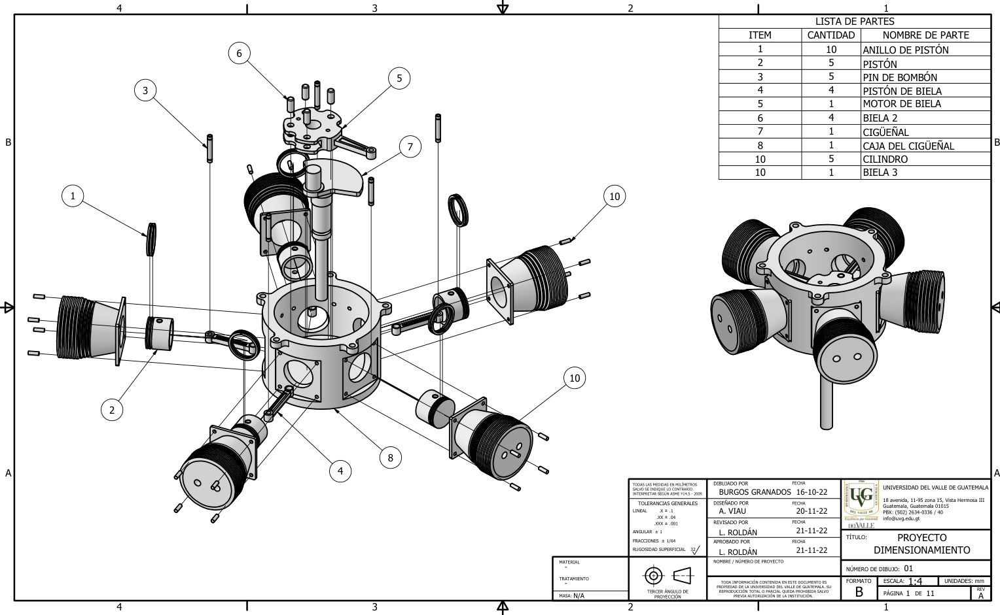

# Portafolio de Proyectos - Modelado 3D y Mecatrónica

¡Hola! En este repositorio comparto algunos de los proyectos que he diseñado y modelado, enfocados principalmente en mecanismos, sistemas robóticos y documentación técnica. La mayoría están desarrollados en Onshape y Autodesk Inventor.

---

## Proyectos de Modelado y Mecanismos

### Brazo Robótico (4 GDL)
Diseño y fabricación de un brazo articulado de 4 grados de libertad. La estructura fue pensada para ser construida combinando corte láser en MDF e impresión 3D.

* [Modelo 3D en Onshape](https://cad.onshape.com/documents/1b56d588919735ab3c3a1b6e/w/47ce03fa257e63046a4ece33/e/f83406a63ae0c7dda04cd087?renderMode=0&uiState=6a4ec798abe20dab73ef4030)
* [Video de funcionamiento en YouTube](https://www.youtube.com/watch?v=1tOhUCxQt9k)

---

### Carro Robótico con Cañón
Vehículo móvil con un sistema de cañón superior funcional. El diseño completo del chasis y las piezas mecánicas se estructuró para impresión 3D, dejando los espacios internos para la electrónica.

* [Modelo 3D en Onshape](https://cad.onshape.com/documents/b27932a9b2ef353405d6f26a/w/ee45256938bf2e92eb1cc889/e/f319d3f1a44d898acee767fe?renderMode=0&uiState=6a4ecb101093faaa4f3127a0)

---

### Elevador de Tijera
Modelado estructural y cinemático de un mecanismo de elevación tipo tijera, diseñado para corte láser en MDF.

* [Modelo 3D en Onshape](https://cad.onshape.com/documents/564cb28ed033534b997508aa/w/f7c370c89f06544858277c89/e/b6d0fbcad5e4f482e98d3064?renderMode=0&uiState=6a4ecab3d884283797d8b081)

---

### Carro Autopropulsado
Prototipo mecánico que utiliza un tren de engranajes interno para almacenar energía y desplazarse de forma autónoma sin necesidad de motores eléctricos. Diseñado para corte láser.

* [Modelo 3D en Onshape](https://cad.onshape.com/documents/d567cb5827177dc9561b27a8/w/056067a2bebb2a77d6cf0ddb/e/149afbb4b14d7d20fa7b68e5)

---

## Diseños en Autodesk Inventor

### Sistema de Parqueo para Doble Vehículo
Modelado y dimensionamiento de piezas para un sistema de estacionamiento optimizador de espacio. Incluye el desarrollo de la estructura principal, un reductor de velocidad por tornillo sin fin y corona, ejes ranurados y el cigüeñal.

| Estructura | Eje | Reductor |
| :---: | :---: | :---: |
|  |  |  |

* [Presentación del proyecto en Canva](https://canva.link/ltfifqiw7c9clwi)

---

## Planos Técnicos y Dibujo de Ingeniería

### Modelado y Dimensionamiento de Motor Radial
Desarrollo de documentación técnica y planos normalizados. Abajo se muestra la vista explosionada con su lista de partes (BOM) para un motor radial de 5 cilindros, detallando componentes como pistones, bielas, cigüeñal y cilindros.

* <a href="img/PLANOS_DIMENSIONAMIENTO2n.pdf" download>Descargar PDF completo de los planos</a>

